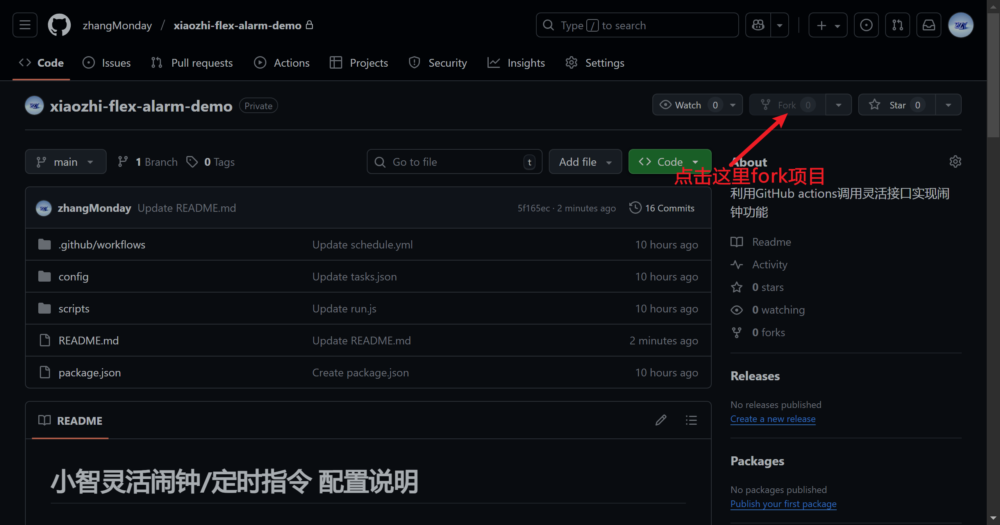
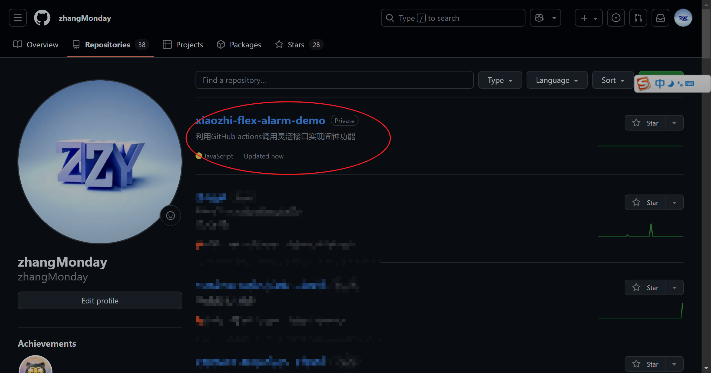
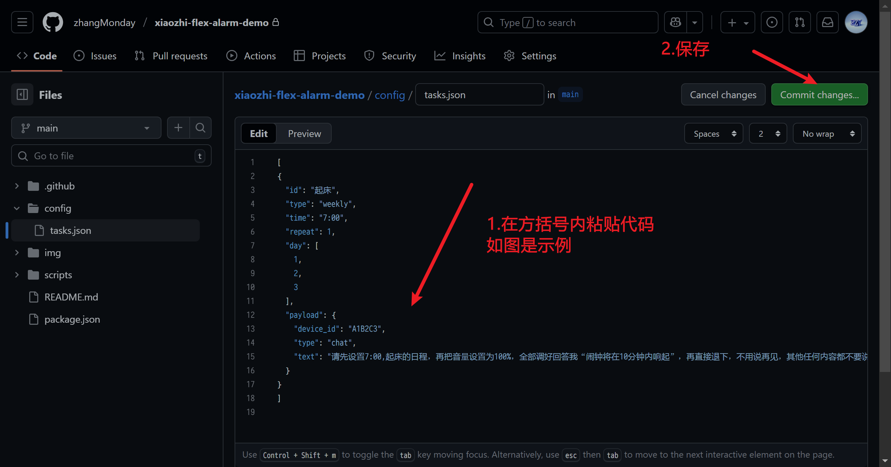
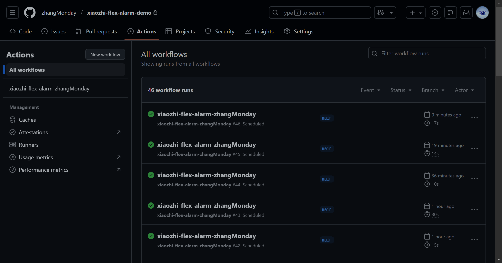
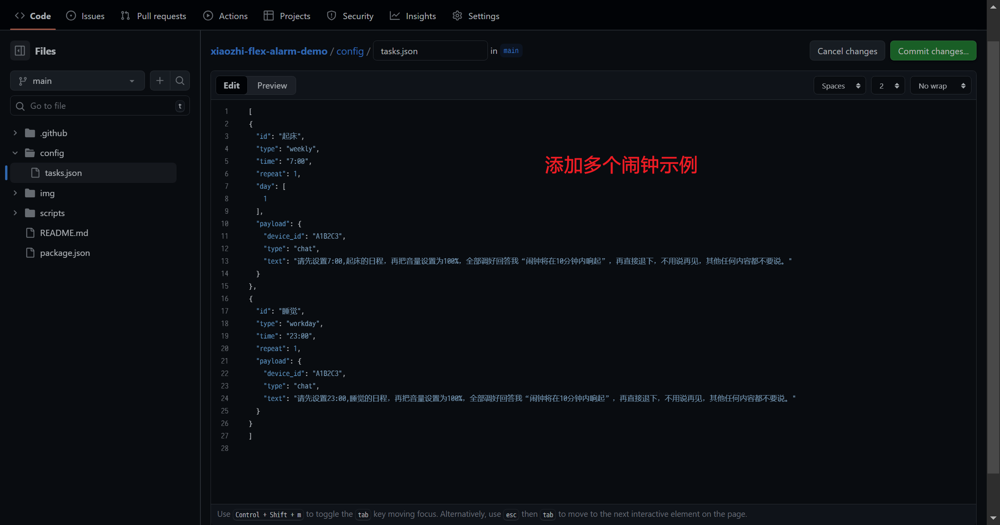
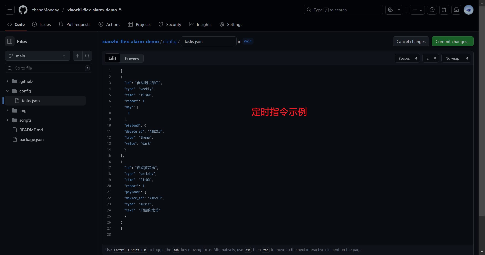

# 小智灵活闹钟/定时指令 配置说明

## 在开始之前
1. 确保你的小智已刷 **1.6.3.58及以上版本** （[灵活固件](https://nodelua.com/home_iot/docs/#/guide/ota)）
2. 确保你有一个github账号（如果没有点右上角**signup**注册）
3. 准备好后，**fork本项目** 开始配置闹钟！

## 创建第一个闹钟
1. 在 [小智灵活远控](https://xiaozhi.zhangmonday.top/) 中，绑定设备，并设定闹钟，接着点击 **“复制请求数据”**
2. 在github repositories中，找到你刚刚fork的项目（**xiaozhi-flex-alarm**）

3. 找到文件 **config/tasks.json**，点击代码块右上角铅笔图标进入编辑模式，在 `[ ]` 里粘贴刚才的代码。然后点击 **commit changes** 保存配置。第一个闹钟至此配置完毕

## 验证闹钟配置
在你fork的github仓库中点击 **actions**，如果出现图中 **绿色的对勾**，则配置成功；如果是 **红叉** 则需要检查一下配置；**黄色** 代表程序运行中，要等几秒才能看结果。

程序会在 **每10分钟检测一次** 是否有即将触发的闹钟，所以每隔10分钟这里就会多一个绿勾。

## 闹钟执行效果
程序会在闹钟响起前 **10分钟左右** 向小智发送新建日程指令，此时小智会播报 **“闹钟即将在10分钟内响起”**

## 创建多个闹钟
1. 在 [小智灵活远控](https://xiaozhi.zhangmonday.top/) 中，绑定设备，并设定新的闹钟，接着点击 **“复制请求数据”**
2. 在 **config/tasks.json** 中，切换为 **英文输入法**，在上一个闹钟配置末尾打一个逗号 `,`，接着粘贴新代码，以此类推。

## 删除闹钟
在 **config/tasks.json** 中，删掉对应配置即可。**注意：最后一项闹钟末尾不要有逗号**。

## 删除所有闹钟
你可以通过 **删库的方法** 一次性删除所有闹钟，但下次定闹钟需要重新fork并配置。

操作方法：**settings → general → 滑到最下方 Delete this repository**

## 拓展玩法：定时指令
你可以修改 **config/tasks.json** 中的 `"payload"` 字段，来定时对小智发送指定内容。[小智灵活远控](https://xiaozhi.zhangmonday.top/) 可以很方便的 **一键复制所有支持的请求参数**，直接粘贴进去即可（记得删掉多余 **花括号**）。

你可以尝试：定时放音乐、定时播报天气、定时控制米家设备、定时切换主题色、亮度、音量等。

### 注意事项
- 由于程序 **每隔10分钟才侦测一次任务**，因此实际响应时间会有 **至多10分钟的误差**（闹钟时间精准是因为给小智传递的参数是具体的北京时间）。
- **请不要设定10分钟以内执行的指令**，这会导致指令被立即执行。

## 参数定义
- **id**：任务标识符
- **type**：任务类型
- **date**：指定日期（每年重复，例：09-13 表示每年 9 月 13 日）
- **weekly**：指定星期（**0=周日，1=周一，...，6=周六**）
- **workday**：工作日（周一到周五）
- **day**：仅 weekly 类型有效，数组形式
- **date**：仅 date 类型有效，格式 **MM-DD**
- **time**：北京时间触发时间，格式 **HH:mm**
- **repeat**：**1=多次执行（循环闹钟），0=单次执行**
- **payload**：请求参数，最终会通过 POST 发送到接口
